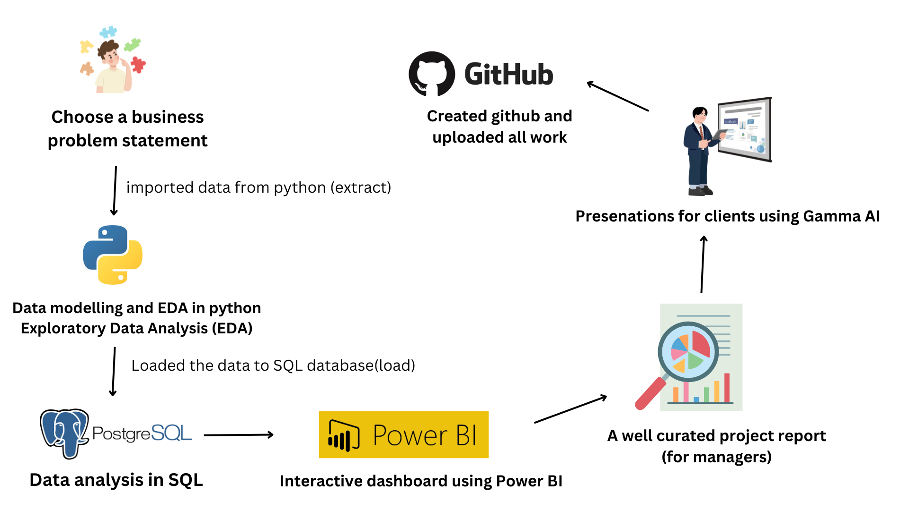

## Customer Behavior Data Analysis project


### Consider this Business Problem Statement:


A leading retail company wants to better understand its customers' shopping behavior in order to improve sales, customer satisfaction, and long-term loyalty. The management team has noticed changes in purchasing patterns across demographics, product categories, and sales channels (online vs. offline). They are particularly interested in uncovering which factors, such as discounts, reviews, seasons, or payment preferences, drive consumer decisions and repeat purchases.

You are tasked with analyzing the company's consumer behavior dataset to answer the following overarching business question:

"How can the company leverage consumer shopping data to identify trends, improve customer engagement, and optimize marketing and product strategies?"


### The deliverables include:

1. Data Preparation & Modeling (Python): Clean and transform the raw dataset for analysis.
2. Data Analysis (SQL): Organize the data into a structured format, simulate business transactions, and run queries to extract insights on customer segments, loyalty, and purchase drivers.
3. Visualization & Insights (Power Bl): Build an interactive dashboard that highlights key patterns and trends, enabling stakeholders to make data-driven decisions.
4. Report and Presentation: Write a clear project report summarizing your key findings and business recommendations. Prepare a presentation that visually communicates insights and actionable recommendations to stakeholders.
5. GitHub Repository: Include all Python scripts, SQL queries, and dashboard files in a well-structured repository.

### Worked with:

- **Python**: Data cleaning and preprocessing
- **Pandas**: Data manipulation and analysis
- **Jupyter Notebook**: Data exploration and transformation
- **SQL (PostgreSQL)**: Data modeling and business queries
- **Power BI**: Interactive dashboards and visualization
- **Git & GitHub**: Version control and project collaboration
- **Gamma AI**: Presentation and reporting

### SQL Analysis

After cleaning and preparing the data using Python, the dataset was loaded into a SQL database (PostgreSQL/MySQL). SQL queries were used to analyze customer purchasing behavior and extract business insights.

Key analyses performed include:

- Revenue comparison across customer demographics
- Impact of discounts on purchasing behavior
- Product popularity and customer review trends
- Shipping type comparison
- Subscription vs non-subscription spending patterns
- Discount effectiveness across products
- Customer segmentation based on purchase history
- Category-wise product demand analysis
- Repeat buyer behavior analysis
- Revenue contribution by age 


### SQL Techniques Used

The following SQL concepts were used during the analysis:

- Aggregations (SUM, AVG, COUNT)
- Subqueries
- Common Table Expressions (CTEs)
- Window Functions (ROW_NUMBER)
- Conditional Logic (CASE WHEN)
- Grouping and Ranking
- Business Segmentation Queries

### How to use this project locally:

1. **Clone the repository**
   ```bash
   git clone https://github.com/ArshTiwari2004/customer-trends-data-analysis-SQL-Python-PowerBI.git
   cd customer-trends-data-analysis-SQL-Python-PowerBI
   ```
2. **Open Customer_Shopping_Behavior_Analysis.ipynb notebook**

    This file contains:

      - Data Import

      - Data exploration

      - Data cleaning

      - Connection to SQL Database
  
3. **Load the data from Python notebook into MySQL/PostgreSQL/MS SQL Server**

      - Create a database in SQL

      - Run Python code to load data into SQL database
  
      - Open **customer_behavior_sql_queries.sql**
  
      - Answer Business Questions using SQL Queries 
      
4. **Connect the SQL Database to Power BI**

      - Open **customer_behavior_dashboard.pbix**
   
      - Create interactive dashboard in Power BI
  
6. **Create Project Report and Presentation**

      - Create project report
   
      - Build presentation deck using Gamma AI

### Workflow involves:




### Dataset Description

The dataset simulates customer shopping behavior for a retail company. It contains information about:

- Customer demographics (age, gender, location)
- Product categories
- Purchase amount
- Discounts applied
- Customer reviews and ratings
- Payment methods
- Purchase channel (Online / Offline)
- Seasonal trends
- Repeat purchases

This data enables analysis of customer segments, purchasing patterns, and drivers of consumer behavior.


### Skills Demonstrated

- Data Cleaning and Transformation
- Exploratory Data Analysis (EDA)
- SQL Data Modeling
- Business Analytics
- Dashboard Development
- Customer Segmentation
- Data Visualization
- Insight Generation for Business Strategy


### Business Impact

The insights generated from this analysis can help the company:

- Improve targeted marketing campaigns
- Optimize discount strategies
- Identify high-value customer segments
- Enhance customer engagement and loyalty
- Improve product and inventory planning

      
